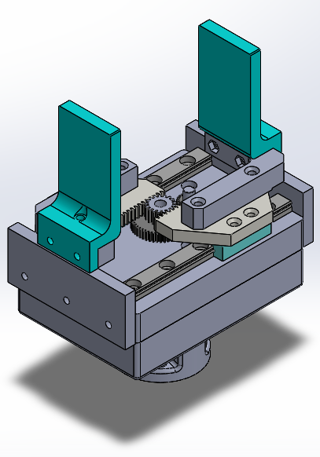

<div  align="center"> 

# 3D Printed Linear Gripper
[](https://opensource.org/licenses/MIT)

[Miguel Arvana](https://scholar.google.com/citations?user=UBvr388AAAAJ&hl=pt-PT)<sup>1</sup>

<sup>1</sup> **NOVA School of Science and Technology, Center of Technology and Systems (UNINOVA-CTS)**,
and Associated Lab of Intelligent Systems (LASI), NOVA University
Lisbon, 2829-516 Lisbon, Portugal

<table>
  <tr>
    <td style="vertical-align: top;">
      A 3D Linear Gripper é uma gripper impressa em 3D eletrica, baseada em contoladores Arduino ESP32. É uma gripper capaz de controlar a sua abertura, velocidade e aceleração, tornando-a perfeita para tarefas de pick-and-place e montagem. A sua força maxima de 40N (~= 4kg), permite-lhe agarrar em uma vasta gama de objetos.
Este repositório contém todos os ficheiros mecânicos, que são de codigo aberto. Isto permite o desenvolvimento de base mounts e ferramentas de pressao (pinças) personalizados permitindo a sua ligação a qualquer braço robotico ou robô, bem como a adaptação a diversos casos. 
O software da gripper tambem é de codigo aberto, permitindo a costumização de velocidades, acelecações e diametros de abertura.
A pinça possui um curso de 58mm e uma massa de 500g
    </td>
    <td style="vertical-align: top;">
      
    </td>
  </tr>
</table>

</div>

## Get Started

## How to build
  - Source all the parts from the bill of materials
  - Follow Gripper Assembly Instructions to assemble your gripper
  - Follow Controller Assembly Instructions to assemble your controller
  - Follow Software to get your gripper up and running.
### Usage instructions
...

### Code Structure
```
3d-linear-gripper        
├── docs                # documentation
│   └── ...
├── imgs                # images
├── src                 # evaluation code
│   ├── ...                     # ...
└── tests               # tests
```
## Documentation
  - Gripper Assembly Instructions
  - Controller Assembly Instructions
  - Bill of Materials
  - Software
## Features

## Contribution Guidelines
NOVA RICS Open Lab open source, and we welcome contributions from the community! See the [Contribution](CONTRIBUTING.md) guide for more information on the development workflow and the internals of the wandb library. For project related bugs and feature requests, visit [GitHub Issues](https://github.com/NOVA-RICS-Open-Lab/3d-linear-gripper/issues) or contact novaricsopenlab@gmail.com.

## Citation
If you use or intend to build on top of  the work in this repo, please consider citing our project:
```bibtex
```

## License
This repository is released under the MIT License. Please see the [LICENSE](LICENSE) file for more details.

## Contacts
Contact us at novaricsopenlab@gmail.com
